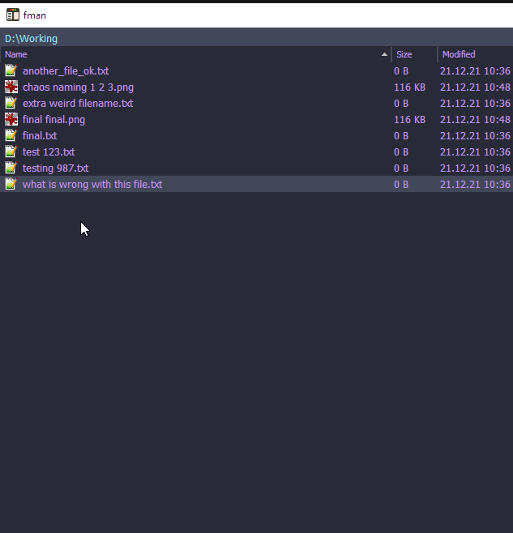
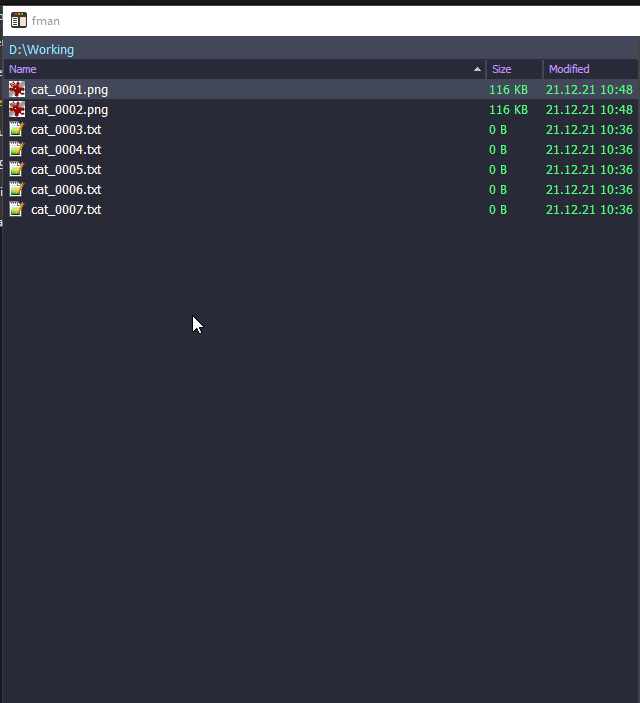

# fman duplicate file and increment index extension
rename the currently selected files from [FMan](https://www.fman.io)

# Install
install the plugin by copying the release to 
> %AppData%\Roaming\fman\Plugins\User

Or just use the "install plugin" function from within fman and search for FManPowerRenamerAndReplacer

# Usage

## Rename

Select one or more files and ctrl+shift+p and search for "power renamer"

Then enter your desired filename. Add as many # as you want to have digits.

So if you want files that look like file_01, file_02, file_03 then enter file_##.

If you want more digits, add more # :)

Add a $ at the beginning to show a preview before doing the actual renaming

## Replace

Select one or more files and ctrl+shift+p and search for "power replace"

Then enter the string you want to search for.

Then enter the string you want to replace that with

Add a $ at the beginning to show a preview before doing the actual replacing.

## Replace