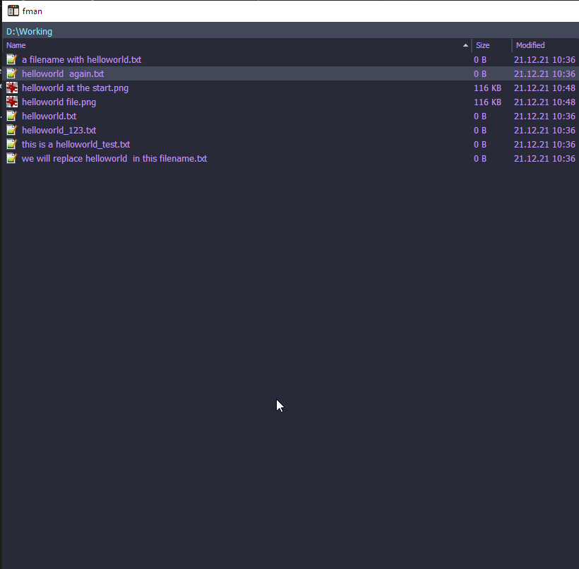

# fman rename files extension

rename the currently selected files from [FMan](https://www.fman.io)

# Install

install the plugin by copying the release to

> %AppData%\Roaming\fman\Plugins\User

Or just use the "install plugin" function from within fman and search for FManPowerRenamerAndReplacer

# Usage

## Rename

Select one or more files and ctrl+shift+p and search for "power renamer"

Then enter your desired filename. Add as many # as you want to have digits.

So if you want files that look like file*01, file_02, file_03 then enter file*##.

If you want more digits, add more # :)

You can also specify a file extension in your pattern (e.g., file\_##.png):

- If the extension matches the original file's extension (case-insensitive), your specified case will be applied (e.g., changing .PNG to .png)
- If you're trying to change the extension to a different type (e.g., from .PNG to .jpg), you'll be prompted for confirmation

Add a $ at the beginning to show a preview before doing the actual renaming

## Replace

Select one or more files and ctrl+shift+p and search for "power replace"

Then enter the string you want to search for.

Then enter the string you want to replace that with

Add a $ at the beginning to show a preview before doing the actual replacing.
